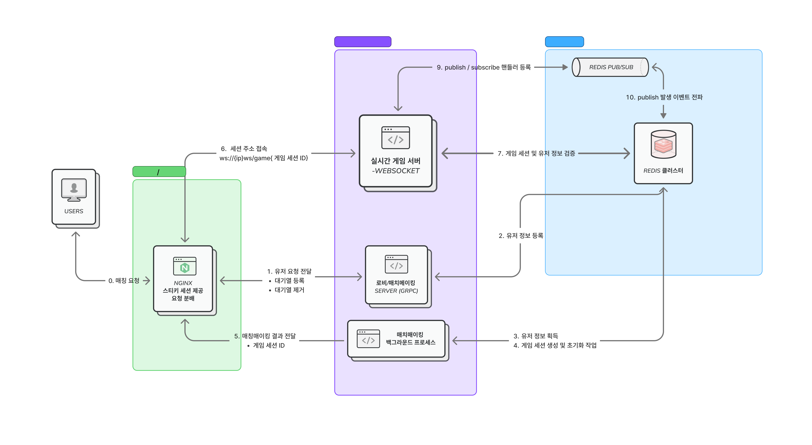

# HaxWar — 분산 기반 실시간 멀티플레이어 게임 서버

`C#` `Redis` `gRPC` `WebSocket`

## 📑 목차

- [전체 아키텍처](#전체-아키텍처)
- [기술 스택](#기술-스택)
- [핵심 기술 결정 및 최적화](#핵심-기술-결정-및-최적화)
  - [3.1 gRPC와 WebSocket 혼용 구성](#31-grpc와-websocket-혼용-구성)
  - [3.2 Redis 클러스터 기반 분산 동기화 및 고가용성](#32-redis-클러스터-기반-분산-동기화-및-고가용성)
  - [3.3 가비지 컬렉션(GC) 최적화 설계](#33-가비지-컬렉션gc-최적화-설계)
  - [3.4 시계열 유닛 이동 및 조우 판정을 위한 SortedList 자료구조 설계](#34-시계열-유닛-이동-및-조우-판정을-위한-sortedlist-자료구조-설계)
- [부하 테스트 검증 데이터](#부하-테스트-검증-데이터)
- [로컬 실행 방법](#로컬-실행-방법)

---

## 전체 아키텍처



## 🛠 기술 스택

| 계층 | 기술 | 비고 |
| :--- | :--- | :--- |
| **게임 서버** | C# / .NET 8 | Stateless 기반 인스턴스 |
| **통신 프로토콜** | gRPC, WebSocket | 요청-응답 / 실시간 통신 분리 |
| **분산 캐시/DB** | Redis Cluster (3M-3R) | 해시 슬롯 샤딩, 자동 페일오버 |
| **데이터 직렬화** | Protobuf | 네트워크 대역폭 및 메모리 압축 |
| **리버스 프록시** | Nginx | WebSocket 프록시 및 커넥션 튜닝 |
| **인프라 테스트** | Docker Compose | 로컬 클러스터 부하 테스트 환경 |

---

## 핵심 기술 결정 및 최적화

### 3.1 gRPC와 WebSocket 혼용 구성

### 기술적 고민
프로젝트에는 두가지 통신 패턴이 공존했습니다. 하나는 매치메이킹과 같은 요청-응답 구조의 단발성 통신과, 다른 하나는 인게임 명령과 같이 빈번한 양반향 통신입니다. 따라서 두가지 통신을 모두 처리하기 위해 gRPC와 WebSocket을 혼용하는 아키텍쳐를 도입하였습니다.

### gRPC를 선택한 이유 — 매치메이킹
gRPC를 도입해 Protobuf로 구조체를 정의하고, 서버와 클라이언트가 동일한 메시지 형식을 사용하도록 강제했습니다. 그 결과 스키마 불일치 로 인한 런타임 오류를 예방할 수 있었습니다. 또한 Protobuf의 강력한 타입 체크 기능으로 인해, 컴파일 시점에 타입 오류를 미리 감지할 수 있었습니다.

### WebSocket을 선택한 이유 — 게임 세션
gRPC 양방향 스트리밍으로도 구현할 수 있지만, 비정형 데이터를 주고받음에 있어 Protobuf의 강력한 타입 체크가 오히려 방해가 됩니다. 또한 여러 종류의 메시지를 하나의 스트림으로 주고받으려면 Any 타입으로 바이너리를 감싼 후, 수신 측에서 식별 코드를 확인해 다시 역직렬화하는 이중 처리 비용이 발생하기 때문입니다

WebSocket은 수신 버퍼에서 미리 약속한 식별 코드 바이트만 읽어 명령 타입을 식별하고, 나머지 페이로드는 해당 타입에 맞춰 곧바로 역직렬화할 수 있어 유연성이 뛰어나다고 판단하였습니다.

---

### 3.2 시스템 내 Redis 활용 사례

```
[Client A] (Node 1 접속)               [Client B] (Node 2 접속)
[Game Server Node 1]                   [Game Server Node 2]
      │                                      │
      ▼                                      ▼
┌──────────────────────────────────────────────────────────────┐
│                  Redis Cluster (3M-3R)                       │
│  - Sharded State Store (Protobuf Binary Storage)             │
│  - Event Sync Broker (Pub/Sub + Self-Publish Bypass)         │
│  - Distributed Lock (SETNX / TTL + Lua Script Safe Release)  │
│  - Global Matchmaking Queue (List FIFO + Hash Storage)       │
└──────────────────────────────────────────────────────────────┘
```

### 문제
2,000명 이상의 대규모 사용자 수용을 위해 서버 수평 확장이 필수적이었으나, 노드 분산에 따른 상태 동기화 및 동시성 제어 시 다음과 같은 문제가 발생할 수 있다고 예상되었습니다.
1. **분산 노드 간 상태 불일치**: 서로 다른 물리 서버에 접속한 유저 간 실시간 인게임 이벤트 전파의 어려움.
2. **동시 접근 레이스 컨디션**: 여러 서버가 동일한 게임방/매칭 대기열 상태에 동시에 접근할 때 Lost Update 발생.
3. **단일 장애점(SPOF) 및 수용량 한계**: 단일 Redis 노드 장애 시 전체 서비스 중단 및 I/O 병목 현상.

### 해결 방안 및 핵심 구현

- **① Pub/Sub 기반 분산 노드 이벤트 브로드캐스트**:
  - Redis Pub/Sub 채널(`game_events:{roomId}`)을 통해 특정 방에서 발생한 인게임 이벤트를 전체 서버 노드에 실시간 전파하였습니다.
  - **Self-Publishing Loop 방지**: 메시지 패킷에 `SourceServerId`를 동시 발행하여, 자기가 발행한 이벤트는 수신 시 즉시 무시(`SourceServerId == ServerIdentity.Id`)하도록 제어해 무한 루프를 방지했습니다.
  - **CircularBuffer 사용 재전송 로직 부재 보안**: Pub/Sub의 메시지 무손실 미보장 특성을 극복하고자 서버 내부 고정 크기 `CircularBuffer`에 패킷 순서를 로컬 적재하여 일시적 순단 시 Redis 재조회 없이 즉시 무손실 복구를 구현하였습니다.

- **② SETNX 및 Lua 스크립트 기반 분산 락**:
  - `SETNX` (SET ... NX PX) 명령과 만료 시간(TTL) 설정을 이용해 게임방 상태 변경 및 매칭 처리 시 분산 락을 구성했습니다.
  - **Lua 스크립트 안전 해제**: TTL 만료 후 타 노드가 획득한 락을 오삭제하는 현상을 막기 위해, `GET`으로 조회한 `LockId`가 자신이 소유한 락일 때만 원자적으로 `DEL`을 수행하는 Lua 스크립트를 적용하였습니다.

- **③ Redis List + Hash 기반 전역 매칭 대기열**:
  - **List + Hash 구조 분리**: FIFO 대기열은 Redis List(`RPUSH` / `LPOP`)로 경량 관리하고, 플레이어 상세 정보(레이팅, 진입시간)는 Redis Hash(`HSET` / `HGET`)에 분리 저장하여 I/O 효율성을 극대화했습니다.
  - **다중 노드 매칭 동기화**: 여러 매칭 서버 노드가 동시에 매칭 처리 함수를 실행할 때 동일 플레이어 중복 인출을 방지하고자 `lock:matchmaking:queue` 분산 락을 획득한 노드만 팝(Pop) 및 방 생성을 전담하도록 구현했습니다.

- **④ Protobuf 상태 압축 및 클러스터 고가용성 (HA)**:
  - 전체 게임 상태를 `Protobuf` 바이트 데이터로 직렬화하여 네트워크 대역폭 및 메모리를 압축 저장했습니다.
  - `StackExchange.Redis`를 통해 16,384개 해시 슬롯의 마스터 노드 다이렉트 라우팅을 구성하고, 마스터 장애 발생 시 `CLUSTER SLOTS` 기반의 자동 슬롯 재배치 및 라우팅을 적용했습니다.

---

### 3.3 가비지 컬렉션(GC) 최적화 설계

### 문제
2,000명 동시 접속 테스트에서 초당 수만 건의 수신/전송 패킷 처리로 인해 메모리 할당이 빈번하게 발생하는 문제가 발생하였습니다. 300초 부하 테스트 결과 gen 2 가비지 컬렉션이 7회 발생하였고 gen 0, gen 1 가비지 컬렉션이 자주 발생하여 GC 수집으로 인한 어플리케이션 멈춤, 프리징 현상이 발생할 수 있음을 확인하였습니다.

### 접근
중간 객체 및 불필요한 힙 할당을 제거하여, 가비지 컬렉터가 정리할 객체의 수를 줄이고, 0세대 가비지 컬렉터의 발생 빈도를 낮추는 것이 중요하다고 생각했습니다.

### 행동
- 소켓 수신부에서 매번 새로운 바이트 배열을 선언하던 구조를 `ArrayPool`로 변경하였습니다. 버퍼를 메모리 풀에서 임대하고 사용 후 반납하는 방식으로 전환하여 0세대 가비지 컬렉션 발생 빈도를 낮추었습니다.
- 송신 측에서는 생성한 패킷을 `ArraySegment<byte>`대신 `Memory<byte>` 타입으로 페이로드의 메모리 주소를 직접 참조하여 전달함으로써 중간 객체가 생성되지 않도록 개선했습니다.
- 수신된 메시지의 역직렬화 과정에서 `MemoryStream` 같은 중간 스트림 객체를 생성하지 않고, 버퍼의 일부 영역을 `ReadOnlySpan<byte>`로 직접 전달하는 고속 처리 경로를 구축하였습니다.

### 결과
부하 테스트 비교 결과 시스템 중단을 유발하는 2세대 가비지 컬렉션 발생 횟수를 7회에서 1회로 85.7% 감소시켰으며, 평균 지연 시간을 0.03ms로 최적화하였습니다. 2,000 세션 활성화 상태에서도 실제 서버의 가비지 컬렉션 힙 크기를 97.89MB로 방어하여, 장시간 구동에도 안정적인 성능을 유지하는 것을 확인하였습니다.

---

## 최적화 전후 성능 데이터 비교

1,000개 게임방(2,000 클라이언트)을 대상으로 아래 로드 테스트 명령을 실행하여 수집한 결과입니다.

```bash
docker compose up --build -d

dotnet run -c Release --project tests/HexWar.LoadTests -- http://localhost:5020 1000 300
```

| 측정 메트릭 | 최적화 이전 (300초) | 최적화 이후 (300초) | 성능 개선 효과 |
| --- | --- | --- | --- |
| **gen 0 가비지 컬렉션** | 47회 | **6회** | 87.2% 감소 |
| **gen 1 가비지 컬렉션** | 14회 | **2회** | 85.7% 감소 |
| **gen 2 가비지 컬렉션** | 7회 | **1회** | 85.7% 감소 |
| **gen 가비지 컬렉션 힙 크기** | 약 232.8 MB | **97.89 MB** | 57.9% 메모리 절약 |
| **세션당 메모리** | 약 116 KB | **50.12 KB** | 56.8% 세션 경량화 |
| **평균 이동 명령 지연** | 0.04 ms | **0.03 ms** | 25% 지연 단축 |
| **지연 상위 99%** | 0.11 ms | **0.08 ms** | 27.2% 대기 시간 단축 |
| **송신 메시지 처리량** | 14,333건 | **18,000건** | 25.5% 처리량 향상 |
| **수신 메시지 처리량** | 52,985건 | **67,846건** | 28.0% 처리량 향상 |

---

> [!IMPORTANT]
**부하 테스트 지표와 실제 서버 지표의 분리**
 
부하 테스트 리포트 하단의 `SERVER RESOURCE` 항목은 실제로는 부하 테스트 클라이언트 프로세스 자체의 리소스입니다. 실제 게임 서버의 성능 지표는 컨테이너 내부 진단 API(`/api/diagnostics/stats`)를 통해 별도로 측정하였으며, 위 표의 최적화 이후 수치는 이 실제 측정값입니다.

---

### 3.4 시계열 유닛 이동 및 조우 판정을 위한 SortedList 자료구조 설계

### 문제
인게임 유닛은 간선(Edge)을 따라 이동하며 목적지 노드까지 1~2라운드 이상의 시간이 소요됩니다. 같은 간선 상에서 상대 진영 유닛과 마주치는 '조우(Encounter)' 판정 및 라운드 경과에 따른 이동 시계열 상태를 관리해야 했습니다.
이때 단순 2차원 배열이나 `List<List<TravelingGroup>>`을 사용할 경우 다음과 같은 구조적 부작용이 발생했습니다.
1. **불필요한 인덱스 패딩 메모리 낭비**: 유닛이 존재하지 않는 라운드 간격까지 빈 배열 요소를 채워 넣어야 하는 희소(Sparse) 데이터 공간 낭비 발생.
2. **배열 Shift 연산 오버헤드**: 매 라운드가 진행될 때마다 모든 요소를 한 칸씩 앞으로 당겨야 하는 `O(N)` 배열 재배치 비용 발생.

### 접근
남은 라운드 수(`remainingRounds`) 자체를 오름차순 Key로 지정하는 **`SortedList<int, List<TravelingGroup>>`** 자료구조를 도입하여 시계열 데이터 표현을 최적화하고자 했습니다.

### 행동
- **희소(Sparse) 데이터 공간 최적화**: 남은 라운드 수 자체를 Key로 활용함으로써 유닛이 존재하는 라운드 정보만 메모리에 유지하도록 구현했습니다.
- **도착 및 조우(Encounter) 고속 판정 경로 구축**:
  - `AdvanceRound()`: 매 라운드 진행 시 Key-1 갱신을 수행하여 남은 라운드가 0 이하가 된 도착 임박 유닛을 빠르게 인출.
  - `FindAllEncounters()`: 동일 Key(동일 남은 거리) 위치에 서로 다른 진영(`PlayerSide.A` vs `PlayerSide.B`) 유닛 그룹이 공존하는지 탐색하여 조우 이벤트를 처리.

```csharp
// src/HexWar.Domain/Entities/Edge.cs
public class Edge
{
    // Key : 남은 라운드 수 / Value : 해당 라운드에 위치한 유닛 그룹 리스트
    public SortedList<int, List<TravelingGroup>> TravelingUnits { get; private set; } = new();

    // 조우(Encounter) 판정 로직
    public bool HasEncounter(int roundRemaining, out List<TravelingGroup>? groups)
    {
        if (TravelingUnits.TryGetValue(roundRemaining, out groups) && groups.Count > 1)
        {
            var sides = groups.Select(g => g.Side).Distinct();
            return sides.Count() > 1; // 동일 위치에 양 진영 유닛이 공존할 때 조우 발생
        }
        groups = null;
        return false;
    }
}
```

### 결과
- 유닛이 존재하지 않는 라운드 간격의 배열 패딩을 제거하여 메모리 할당을 최소화하였습니다.
- 남은 거리가 정렬된 상태를 유지함으로써 도착 유닛 순회 및 조우 판정의 연산 복잡도를 개선하고 턴 진행의 데이터 일관성을 확보하였습니다.

---

## 4. 로컬 실행 방법

로컬 환경에서 인프라 구동 및 부하 테스트를 재현할 수 있는 명령어입니다.

```bash
# 1. 인프라 컨테이너 구동 (Redis Cluster, Nginx, Game Server)
make docker-cluster-start
또는 
docker compose -f docker-compose.cluster.yml up --build -d

# 2. 2,000명 동시접속 부하 테스트 수행 (1,000개 게임방, 300초)
dotnet run -c Release --project tests/HexWar.LoadTests -- http://localhost:5020 1000 300

# 3. Nginx 예외 및 에러 로그 검증
docker logs hexwar-nginx 2>&1 | grep -iE "error|crit|alert|emerg|warn"
```
